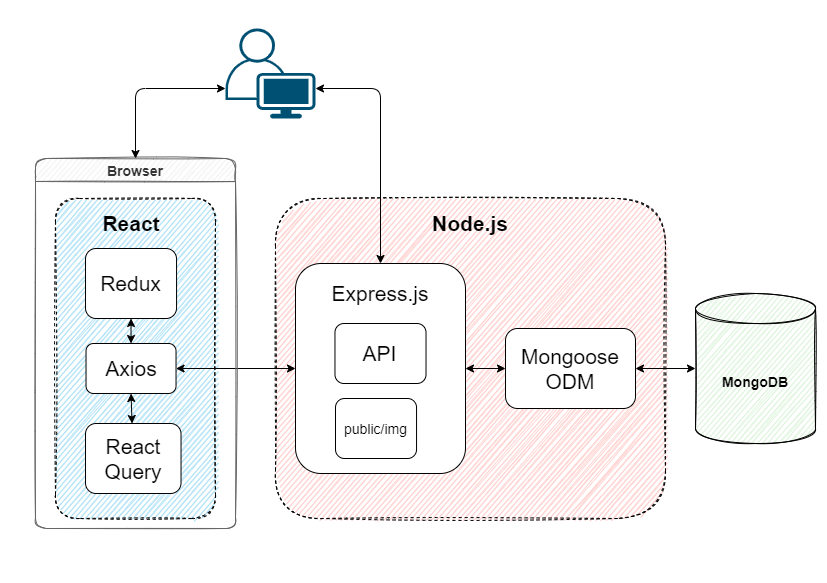

# Mondai Tracker

[Live Site](https://mondai.netlify.app/)

## Background & Overview

Mondai tracker is project management tool that provides a platform for collaborative work. Users can create their own projects, invite other users and share the backlog of user stories & tasks so everyone can stay organized. With this shared project view of the team's work, it should be obvious at a glance who's responsible for what and what's coming next. The workflow and UI is heavily influenced by Pivotal tracker and Trello.

## Technologies & Challenges

Mondai Tracker is built with the MERN stack. The backend features a frontend agnostic REST API servicing the client side.

### Architecture

**Client Side**: `React` / `Redux Toolkit` / `React Query` / `React Router` / `Lodash` / `Chakra UI` / `Axios`

**Server Side**: `Node.js` / `Express.js` / `MongoDB` / `Mongoose ODM` / `Passport.js` / `jsonwebtoken`

